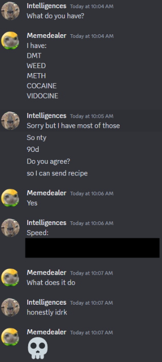
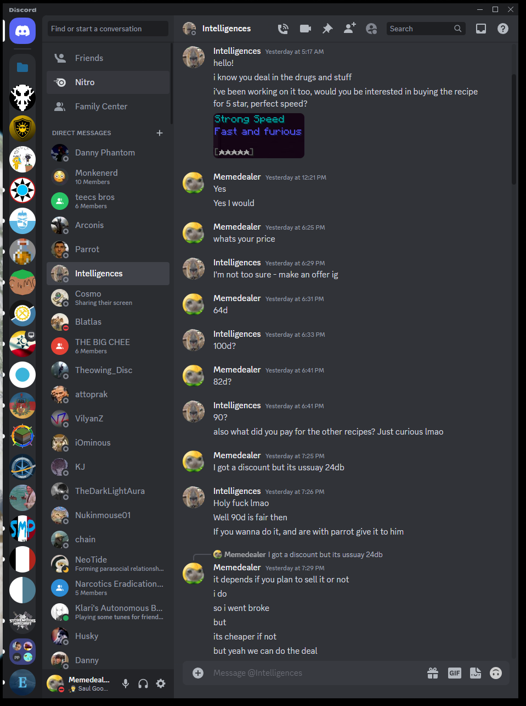
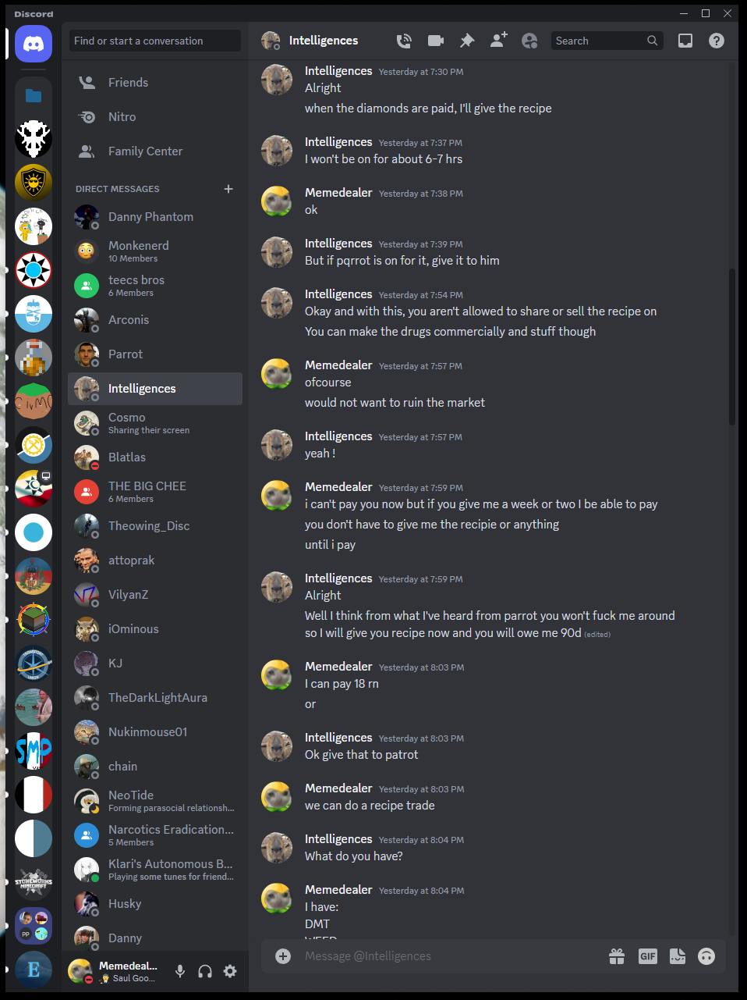
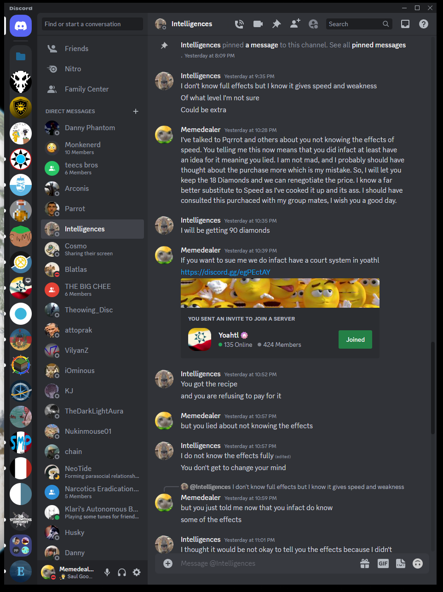
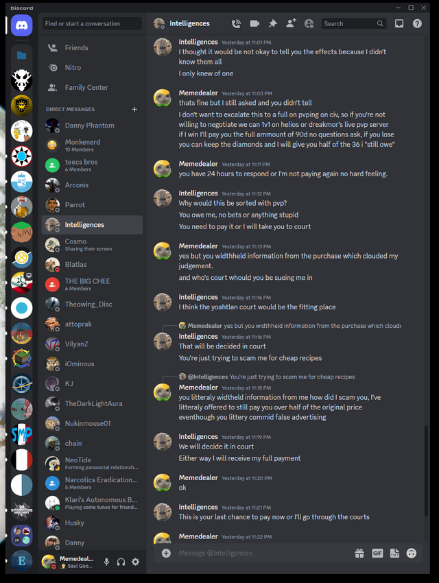
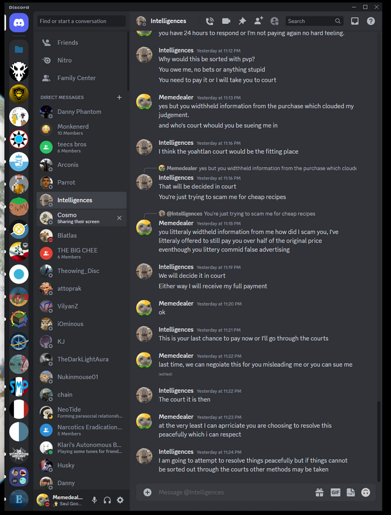
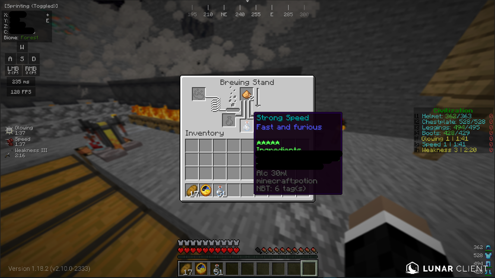
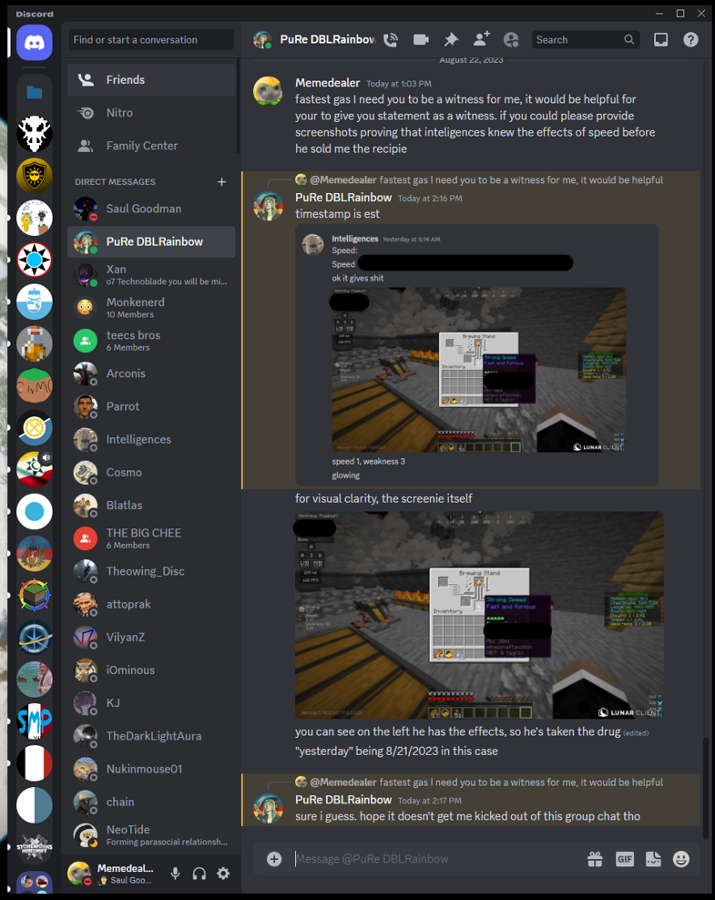
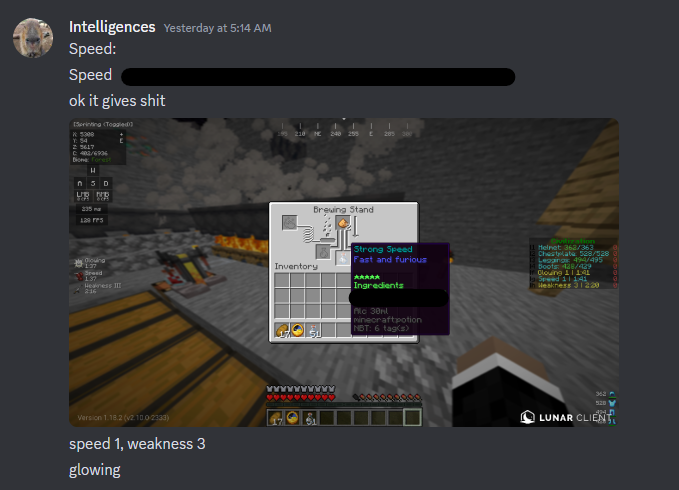
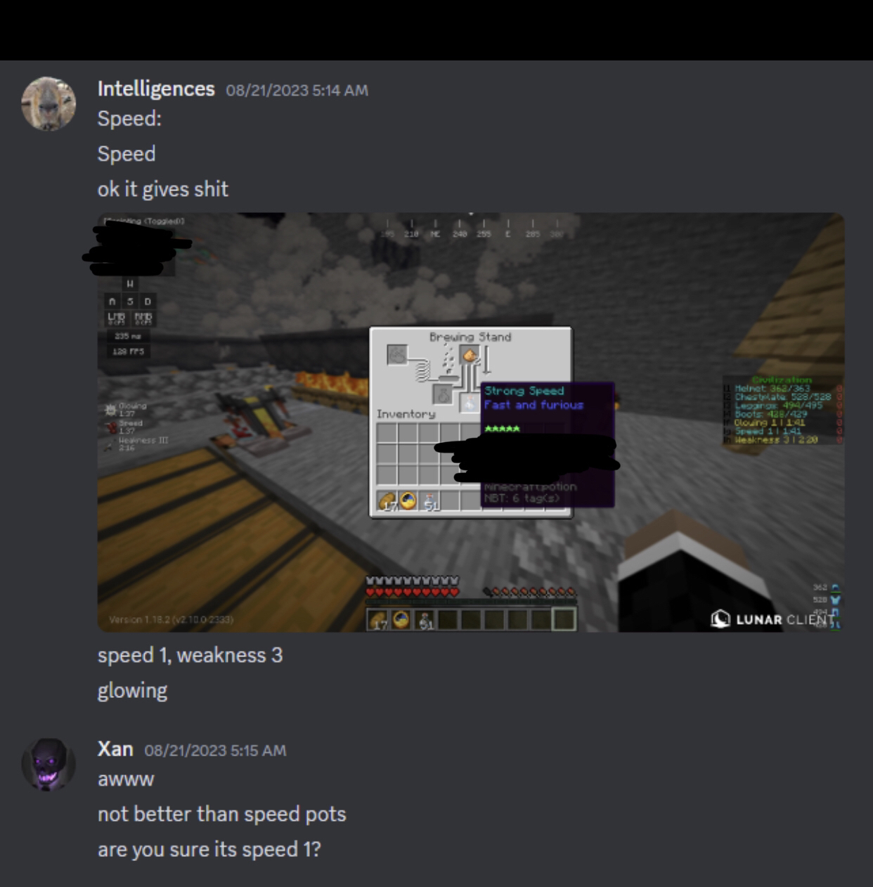

# Intelligences v. Matt4Fun, Aug 2023
## Case

With JessieJinx presiding, on the 22nd of August 2023, Intelligences charged Matt4Fun with withholding payment and breach of contract. Matt4Fun was found guilty of withholding payment and breach of contract, and ordered to pay 45 diamonds total to Intelligences. The payment was made to only be half of the original amount owed, as Jessie ruled that while Matt4Fun should have done his due diligence, the transaction was still marred by incomplete information.

## Proceedings
**intelligences**:

> `@Huskydog9988` I would like to create a trial between me and `@bananakaiser27` for witholding payment/breach of contract

**Huskydog9988**:

> Can you tell me if any other gov members are involved?

**ascant**:

> No other government members are involved from my understanding.

**Huskydog9988**:

> The court will hear the case of Intelligences VS Matt4Fun for Withholding Payment & Breach of Contract. 
> `@jessiejinx`  will be presiding
> 
> All parties please familiarize or refresh yourselves on the court procedure. 
> 
> https://docs.google.com/document/d/1urUJ9o7k2CByBADDL66sHWqrjucepf6FzqIYRAxThgc/edit?usp=sharing Everyone involved please look over this to familiarize yourself with the procedure  of the court.
> 
> Also note any extraneous comments in this channel not related to the trial or anyone not called by the courts to present  testimony will be deleted from this point until the end of trial. Please hold any other cases till the end as well. I SHOULDNT HAVE TO PUT THIS BUT ANYONE PARTICPATING IN THE TRIAL PLEASE WAIT TO SPEAK UNTIL CALLED UPON BY YOUR JUDGE AND LET THEM KNOW WHEN YOU HAVE FINISHED YOUR STATEMENTS.
> Since I know both parties are using lawyers, `@bananakaiser27` `@intelligences` can you both state for the record who will be representing you?

**bananakaiser27**:

> `@awesome_daniel` shall be my elawyer for this case

**intelligences**:

> I will be having `@ascant` representing me for this case.

**jessiejinx**:

> Alright opening statement please first well hear from the prosecution being intelligence lawyer `@ascant`  and then plantiff's being Matt's lawyer `@awesome_daniel`  Ascant if you please...

**ascant**:

> `@intelligences` offered to sell `@bananakaiser27` the recipe for Speed. They completed this deal for 90 diamonds, and made the agreement that Matt would not share or sell the recipe to anyone else. Matt was disappointed with the effects of Speed, something completely out of Intelligences` control. Matt then falsely claimed Intel scammed him, and that Intel knew the effects previously, but didn’t tell him. This implies that Intelligences found the recipe to Speed, tried some of it, learned the effects, and then decided to withhold this information for no logical reason. Matt is now trying to renegotiate the price, and is refusing to pay what is owed.
> Intel has only been paid 18/90 diamonds.

**awesome_daniel**:

> My apologies for interrupting your honor. I would like to kindly bring to your attention a small correction regarding the identification of the parties in this case. 
> 
> Under RULE 1.040 §C.1 of the State of Yoahtl Code of Court Procedure it is stated that "The presiding judge will call on each side to present an opening statement with the prosecution proceeding first and the defense then submitting a plea in regard to the plaintiff's statement either pleading in guilt or non-guilt".
> 
> In your opening statement instructions, it was mentioned that Intelligences is the prosecution, and Matt is the plaintiff. However, the roles are reversed, with Intelligences being the plaintiff and Matt being the defendant in this case.

**jessiejinx**:

> and were picking on my spelling errors now...  this is my first case a judge give me some breathing room....anyway
> danial your turn for opening statements please then well hear matt's plea

**awesome_daniel**:

> My client, Matt, engaged in a deal with the opposing party, Intelligences, involving the exchange of 90 diamonds for the recipe for Speed. Matt paid an initial sum of 18 diamonds to Pqrrot, along with a promise to settle the remaining amount at a later time. Intelligences initially claimed to be ignorant of the effects that Speed would give, but upon closer examination, it became clear that Intelligences was aware of the recipe's effects even before the transaction took place. In response, Matt chose to withhold the remainder of the payment, citing valid concerns about the lack of transparency and integrity in the initial transaction. We assert that there was an obligation on the part of Intelligences to provide full and accurate information about the virtual substance involved, and as a result, on behalf of Matt, we assert a counterclaim of failure to disclose. We contend that Intelligences failed to provide full information about the effects of Speed during the transaction, thereby undermining the foundation of informed consent that any transaction requires.

**jessiejinx**:

> what is the plea `@awesome_daniel` guilty or not-guilty?

**awesome_daniel**:

> My client `@bananakaiser27` pleads not guilty.

**jessiejinx**:

> alright `@ascant`  present your evidence and witness if you have any

**ascant**:

> It's important to mention how these events happened in order. The deal was proposed, the deal was then accepted. After the deal had already been partially paid and mutually agreed upon, Matt had asked what the effects were. 
> 
> "We contend that Intelligences failed to provide full information about the effects of Speed **DURING** the transaction."
> Assuming the best, this is misinformation from Matt's end to his lawyer. 
> I am going to reference my first piece of evidence as image.png. ||crazy name I know||
> Here you can see negotiations on price, albeit cut off but I would argue it's not important to this case anyway. Then you see accepting of the deal, "90d, Do you agree?" Matt then says, "Yes" and Intel follows up with the recipe for Speed. Notably it's blacked out, but if it's important to the case we are willing to share it privately. 
> 
> This shows that not only were the list of effects of speed not in the deal, they weren't even discussed until after the deal had finished.
> 
> While it's not important to the case, I will further explain what happened with the disclosure of effects.
> Intelligences had genuinely not known the effects of perfect speed. He had successfully made some, but hadn't tested it yet. However, he had successfully made and tried a lower tier speed. The difference between each tier is enough for the information he had known about the lower tier of speed to be completely disregardable.

**jessiejinx**:

> do you call on any witnesses?

**ascant**:

> I do have witnesses on stand by, but do I have to call on any witnesses?
> New to the lawyer thing
> If I do not have to, then I do not call on any witnesses.

**jessiejinx**:

> its up to you if you wish to call on witnesses but it could help your case.
> this wil be your only chance to call on any witnesses if you have any

**ascant**:

> Alright, I do not want to call any witnesses.

**jessiejinx**:

> Alright `@awesome_daniel` your turn to present your evidence and witness if you have any.

**awesome_daniel**:

> The definition of a transaction is “an exchange or transfer of goods, services, or funds” ("Transaction", [Merriam-Webster.com Dictionary]). However, Intelligences claimed to be unaware of the effects preceding the initial payment, meaning that the transaction had not yet been completed. The initial interaction was characterized by a verbal agreement, where Matt made a promise to provide the payment and Intelligences provided the recipe for Speed. Following this verbal agreement, Matt inquired about the nature and effects of the drugs he received. At this juncture, Intelligences claimed to be unaware of the effects. Matt then made the payment for the drugs, marking the completion of the transaction. However, Matt was to later uncover that Intelligences was, in fact, knowledgeable about the effects before the transaction. It was this revelation that led Matt to reconsider providing the rest of the payment, particularly in light of the fact that complete information had not been disclosed.
> 
> Images 1-6, presented herewith, encompass the comprehensive dialogue exchanged between Intelligences and Matt, forming a vital context. Now direct your attention to Images 8 and 9, where we are provided with concrete evidence that Intelligences had shared the complete effects of the highest tier of Speed with Fastestgrass before the deal. A crucial facet to observe is the timestamps of when the transaction took place and notice how Intelligences did, in fact, experience the effects of the highest tier of Speed prior to the transaction, yet consciously refused to disclose this information when asked.
> 
> In Image 7, it becomes evident that Intelligences was under the effects of Speed prior to the transaction, further reinforcing the discrepancy between his claimed lack of knowledge and his actual familiarity with the matter.
> Image 4 further elucidates the matter by underscoring the fact that Intelligences, at a certain point, even conceded awareness of “some” of the Speed's effects – a notable concession that cannot be dismissed lightly.
> 
> Intelligences subsequently articulated a rationale for his non-disclosure in Image 5 stating that he “thought it would be not okay to tell you the effects because I didn’t know them all / I only knew of one”. This assertion stands in stark contradiction to the truth. Preceding the initial interaction between Intelligences and Matt, Intelligences corresponded with Fastestgrass, sharing the effects of the highest tier of Speed, as shown in Images 8 and 9.
> 
> The implications are profound. This trove of evidence not only raises questions of honesty but underscores a breach in the obligation to divulge vital information. This, in turn, furnishes Matt with a compelling justification for the decision to breach the contract given the evident contrast between the initial transaction and the revelations that followed.
> 
> I call upon `@fastestgrass` to take the stand and provide his testimony regarding the conversations and exchanges that transpired between the parties involved. 
> 
> Thank you, Your Honor.
> 

> (Images deleted due to censorship issues)

**fastestgrass**:

> For the record, I'd like to say that I provided that screenshot and agreed to testify based on 2 things:
> 
> 1. Matt had already paid for the recipe, so there wasn’t confidential information being leaked
> 
> 2. I was under the impression that Matt had asked for the effects of the drug, Intelligences denied knowing what it did, and then Matt purchased it anyway, implying that Intelligences had deliberately withheld information and scammed him by obfuscating the actual value of the recipe.
> 
> However, upon seeing the messages, it has been made apparent to me that Matt only asked for the effects of the drug after Intelligences had sent him the recipe. I will leave my personal feelings on the matter out of my testimony, as the courtroom is not the place to speak of them, but I feel that this is an important fact to note.
> 
> Furthermore, I can confirm the authenticity of these screenshots. However, I would like to point out an inaccuracy in this statement. This screenshot is not showcasing the effects of the highest tier of Speed, as alleged. Unbeknownst to me at the time, had I just scrolled down a little more, I would have seen that the effects were only from a 3-star version of the drug, as shown in the attached screenshot. Therefore, it's plausible that Intelligences genuinely may not have known the effects of the full 5-star brew, though whether it was acceptable to withhold the effects of the 3-star variant or reasonable to speculate the effects would have been drastically different is up to the judge/jury to decide.
> 
> Regardless, I can at the very least attest that the evidence on desplay is legitimate, and that these are the facts of the matter.

**jessiejinx**:

> thank you `@fastestgrass` `@awesome_daniel` any more evidence or witnesses?
> and does `@ascant` wish to cross examine the witness

**awesome_daniel**:

> Images 7, 8, and 9 resubmitted due to censorship issues.

**ascant**:

> Their witness has already basically agreed with our argument. I feel no need to cross examine them any further. None of what has been sent hurts our argument in any way, at least after Fastest clarified further. I do want to mention that not only has Matt failed to deliver on his part of the deal, he has now broken the only other terms of the deal, as he failed to prevent his lawyer from leaking the recipe of speed to the entire server. This has now changed this case from a slight breach of contract to a full breach of contract. All terms have now been broken.

**fastestgrass**:

> Screenshot re-uploaded due to censorship/skill issue

> Wait, skill issue again. He replies and says it’s from a 3 star variant. I’m at the beach and don’t have my computer, so it’s a bit hard. Idk why it got shifted down. You all saw it, I hope this suffices. If not, i’ll redo it when i’m home in a few days

**jessiejinx**:

> Has the defence finished?

**awesome_daniel**:

> Yes your honor, we have concluded.

**jessiejinx**:

> any additional fact that either same by wish to present before we begin closing statements?

**ascant**:

> Im all good for closing statements.
> Sorry for the late response :)

**jessiejinx**:

> `@awesome_daniel` any additional fact before closing statements?

**awesome_daniel**:

> No, we are ready for closing statements

**jessiejinx**:

> ok first well hear closing statements by the plaintiff `@ascant`  then by the defense `@awesome_daniel`
> ascant you firnst

**ascant**:

> This entire case comes down to a misunderstanding at the end of the day. Two people agreed to a deal, one felt scammed, and payment was withheld. I feel this case has cleared up any confusing or misunderstanding, and hopefully both parties understand what should have happened. I feel it's important to mention I don't want any bad feelings between parties. As for reparations for the incident, I request 90 diamonds payment on top of the 18 already paid. This concludes my closing statement.

**jessiejinx**:

> `@awesome_daniel`  your closing statement?
> `@awesome_daniel`  you have 24 hours to present your closing statment

**awesome_daniel**:

> While it has been brought to light that the knowledge of the effects stemmed from a lower tier substance, this fact does not absolve the obligation to share this information with Matt. It is immaterial whether the knowledge was derived from a higher or lower tier Speed; the central tenet remains unchanged. Parties to an agreement have a duty to ensure that all relevant information is shared openly. The fact that Intelligences possessed knowledge of the effects of Speed, even if they originated from a lower tier, calls into question the sincerity of the exchange and raises concerns about the transparency of the deal.
> 
> It is not merely a matter of one party feeling scammed, but rather a situation where the foundation of the agreement was compromised by incomplete information. We assert that when the foundational understanding of a transaction is marred by differing expectations, it is not just prudent but imperative to reevaluate the terms. In essence, if the very basis of the agreement is cast into doubt, the logical course of action should be to invalidate the original conditions and initiate a renegotiation that is based on mutual clarity.
> 
> This divergence warrants a reassessment of the initial agreement. In the spirit of fairness and justice, a resolution that takes into account the incomplete information shared during the transaction would be appropriate.
> 
> Thank you for your time.

**jessiejinx**:

> First off can i say that you're both idiots and this is a stupid on that note, matt will play half of what is owed so the sum of 45 diamonds to intel my reasoning is that matt should of done his due diligence and asked what the effects of speed were first before any transaction were to begin. This is my ruling and im going for some pain killers now you both give me headaches..

