# Nukinmouse01 v. Torynado, Oct 2023
## Case

With Awesome_daniel presiding, on 3rd of October 2023, Nukinmouse01 charged Torynado with minor harassment. In a counter claim, Torynado charged Nukinmouse01 with major harassment. Torynado pleased gulty to minor harassment, and was sentanced to 21 days pearl time, and 21 days of timeout in the Discord. Nukinmouse01 was found not guilty of major harassment.

## Proceedings
**nukinmouse**:

> `@Huskydog9988` I would like to sue `@torynado` for harassment.

**Huskydog9988**:

> The court will hear the case of Nukinmouse01 VS Torynado for harassment. 
> `@awesome_daniel` will be presiding
> 
> All parties please familiarize or refresh yourselves on the court procedure. 
> 
> https://docs.google.com/document/d/1urUJ9o7k2CByBADDL66sHWqrjucepf6FzqIYRAxThgc/edit?usp=sharing Everyone involved please look over this to familiarize yourself with the procedure  of the court.
> 
> Also note any extraneous comments in this channel not related to the trial or anyone not called by the courts to present  testimony will be deleted from this point until the end of trial. Please hold any other cases till the end as well. I SHOULDNT HAVE TO PUT THIS BUT ANYONE PARTICPATING IN THE TRIAL PLEASE WAIT TO SPEAK UNTIL CALLED UPON BY YOUR JUDGE AND LET THEM KNOW WHEN YOU HAVE FINISHED YOUR STATEMENTS.

**awesome_daniel**:

> Thank you. Court is now in session.
> I call upon the prosecution, represented by `@nukinmouse`, to deliver an opening statement.

**nukinmouse**:

> As said in *Aki vs Sventhar October 2019*, every Yoahtlan has right to be free from harassment. Tory has constantly harassed me over a dereliction that was retroactively approved by the Government of Yoahtl (before I was Councillor). While I was counciller, I had derelicted an inactive build she has been attacking my character over and over in vc and dms with other players. Tory has been telling me to kill myself after an arguement in vc and when cleaning up plant matter from the trees that she grew over the trench. And she has done other various actions that caused other players to ask her to stop, but some she still does to this day. As a result I wish to charge her with Minor Harassment as laid out in *Nation of Yoahtl Appellate Court* Document

**awesome_daniel**:

> Thank you. I will now turn to the defense, represented by `@torynado`, to issue a plea in response to the charges brought forward by the prosecution, either in guilt or non-guilt.

**torynado**:

> Thank you your honor.  
> 
> May I get the links to the aforementioned documents before entering a plea?

**Huskydog9988**:

> https://civyoahtl.github.io/judiciary/court-cases-precedents/#aki-v-sventhar-oct-2019

**awesome_daniel**:

> Certainly. As referenced in the prosecution's opening statement, here are the links to the relevant documents:
> 
> 1. The court case in question: https://civyoahtl.github.io/judiciary/court-cases-precedents/aki_v_sventhar_oct_2019
> 2. The Appellate Court ruling: https://civyoahtl.github.io/storage/court/Nation-Of-Yoahtl-Appellate-Court.pdf
> 
> Feel free to review the documents, and when you are ready, you may proceed with submitting a plea.

**torynado**:

> Thank you 👍
> I plead guilty to minor harassment and would like to sue Nukin for major harassment.
> Thank you your honor

**awesome_daniel**:

> The court recognizes the defendant's guilty plea to the charge of minor harassment and the counterclaim for major harassment against the prosecution. Please proceed with your opening statement.

**torynado**:

> Thank you your honor.
> Might you clarify to whom you refer to as "the defense" now that I plead guilty?
> Idk if this is a counter suit or different trial
> Thanks again!❤️
> Counter claim is most efficient
> What if I don't counter sue.  And sue on a later date?  Or not at all?
> Hmmm

**awesome_daniel**:

> My apologies, the former prosecution shall henceforth be referred to as the counter-defendant and the former defense shall now be referred to as the counter-claimant.
> To clarify further, the proceedings will transition from the defense to the counterclaim. We have now moved from the defense's presentation to the counterclaimant's case. The guilty plea entered by the defendant to the charge of minor harassment will be addressed at the conclusion of this trial. We will first proceed with the counterclaim proceedings, and the matter of the guilty plea will be addressed during the final phase of these proceedings.

**torynado**:

> Got it.  Thanks!  ❤️ opening statement soon
> Thank you for your patience, your honor.
> 
> Space Volcano says it best with a TL;DR in court document 2.
> *Don't be a dick guys. Be reasonable, be courteous, be respectful. Our discord is a privilege. Keep it fun, and memes are more fun if everyone is in on them.*
> 
> With that I'm mind, I may provide evidence etc. of counsillor nukins intentional harassment of me in the spirit of the October, 2019 Appellate Court Ruling
> 
> *3. Major Harassment
> A severe act of Harassment by an acting individual done in a cruel and
> intentional manner done; with the intent of forcing someone to leave the
> community via means of repeated harassing acts, with the intent to cause
> someone great emotional distress, and/or with the intent of immense
> communal disruption.
> *

**awesome_daniel**:

> Thank you for your opening statement. I now invite the counter-defendant, `@nukinmouse`, to present their response to the counterclaim.

**nukinmouse**:

> i dont really know how to respond to this as there isnt really anything to respond to right now
> i guess, i havent harrased tory and this case doesnt have ground to stand on

**awesome_daniel**:

> Thank you for providing your position. Your disagreement with the counterclaim is sufficient as a response.
> I would now like to call upon `@torynado` to present any evidence or witnesses in support of the counterclaim.

**torynado**:

> Thank you your honor.  
> 
> I'd like to submit evidence of Counsillor Nukinmouse intentionally killing me twice with malicious intent.  At Kobylinski and at Altepetl.

**nukinmouse**:

> `@awesome_daniel` im sorry to interupt but is there some legal way we can speed this along

**awesome_daniel**:

> After the presentation of any evidence, and if both parties are in agreement, we can consider skipping any cross-examination and/or closing statements and proceed directly to the ruling.
> `@torynado` please finish submitting evidence in support of the counterclaim.

**torynado**:

> Thank you your honor.  I'm nearly finished assembling the supporting evidence.

**awesome_daniel**:

> `@torynado` please try and submit your evidence by <t:1696642560:t> (48 hours after initial notice).

**torynado**:

> Thank you for your patience.
> Point 1 - No one should tell people to kill themselves.
> We shouldn't tell people to kill themselves in any context of any form of semantics.  
> i told Counsillor Nukinmouse to
>    "Die in hell"
>    "Jump off a cliff"
>    "i hate you"
> 
> in my opinion, Counsillor Nukinmouse was more angry that I said that "i hate" him whilst i'm feeling real emotional distress. https://media.discordapp.net/attachments/348687557455904778/1159961851103293550/evidence_nukinmouse_2.png?ex=6532eda8&is=652078a8&hm=d9bc9a53342e8f3562d52b85fa05af87c2d8c19f2248d762a077e82929ab2e16&=&width=304&height=676
> 
> Part of this hatred is that Nukinmouse constantly replies to actual conversations in vc with "Why don't you kill yourself" to me and others.  I hate it when he does it every time. https://media.discordapp.net/attachments/348687557455904778/1159961776893480980/evidence_6_x1025.jpg?ex=6532ed96&is=65207896&hm=cead382bcb47e8ca55eccd5139e875284c898cf37cc1e1930c4b2e8cc75a0e26&=&width=615&height=676
> 
> Saying, "Why don't you kill yourself?" is part of Counsillor Nukinmouse's regular speech pattern.  It's not nice.
> now uploading some private conversations for "context"
> Point 2 - Counsillor Nukinmouse is a Destroyer whilst I am a Preservationist
> 
> No other yoahtlan, on this iteration being CivMC, has initiated and participated in the demolition of Yoahtlan builds more than Nukinmouse.  
> 
> Nukinmouse has torn down far more Yoahtlan homes builds than he's built.
> 
> Now he intends to tear down and lower the height of Altepetls Great Mosquito Pigeon.
> `@MechanicalRift` was in the VC with me and Nukinmouse for that.
> 
> Point 3 - Muting, Time outs and soundboard "burger, burger, burger" administered in with cruel intentions
> Counsillor Nukinmouse doesnt just apply these punishments because i talk too much or that my mic is lame on my phone or i walked away with the tv on.  He does it with cruel intent to drown me out when he doesn't like what I have to say.  He does it to exclude me.  
> He does it because he knows im gonna tell him not to tear down the great mosquito pigeon.  
> He does it because im gonna tell them not to build a dick in gang shi
> He does it because im gonna tell them not to rip off Nara nor pick a war with them
> He does it because i don't approve of being willingly insided by Gang Shi.  No offense to tal's art.  that's kewl. 
> He does it because he knows i'm gonna tell the lil white boys that its not okay to say the n bomb
> He does it because i will discourage face reveals in this imperfect community
> He does it because he gets a laugh
> *He does it because he can*
> 

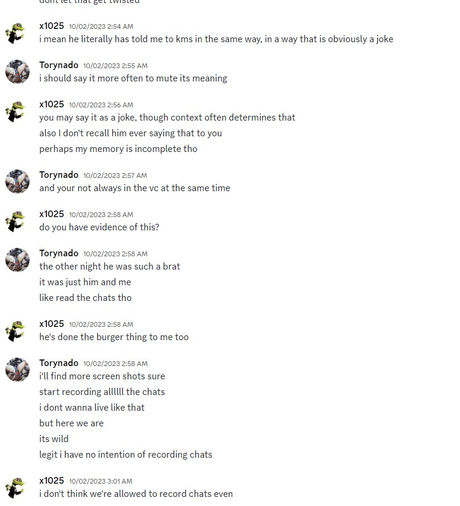
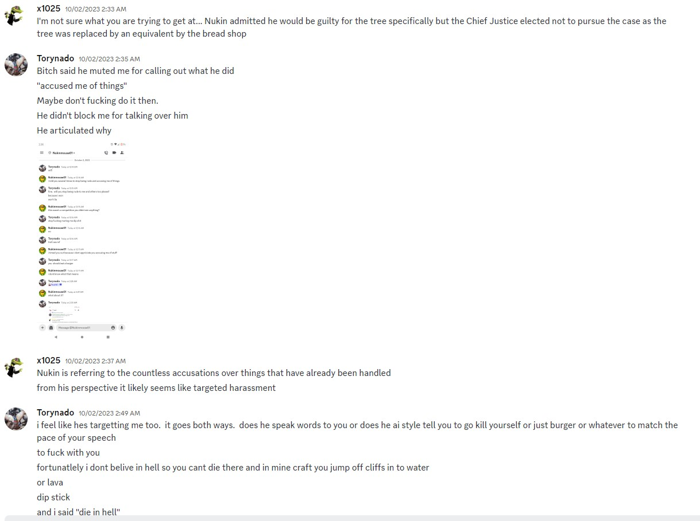
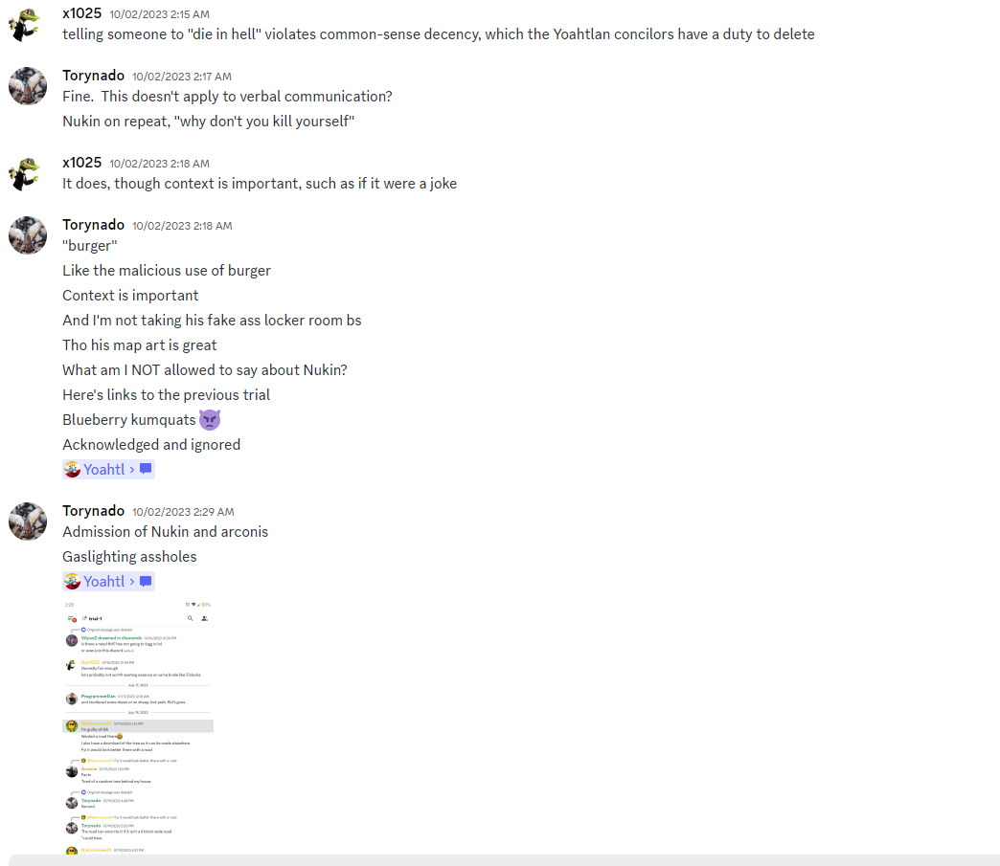
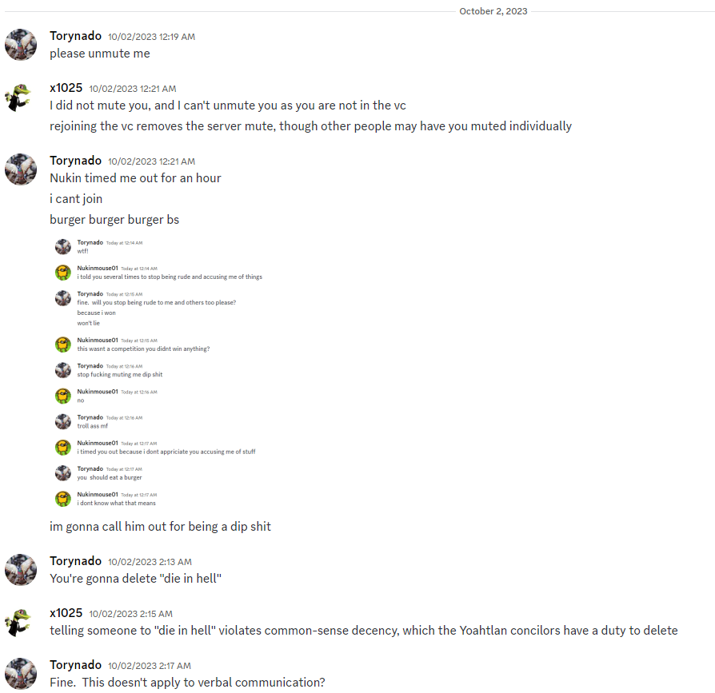
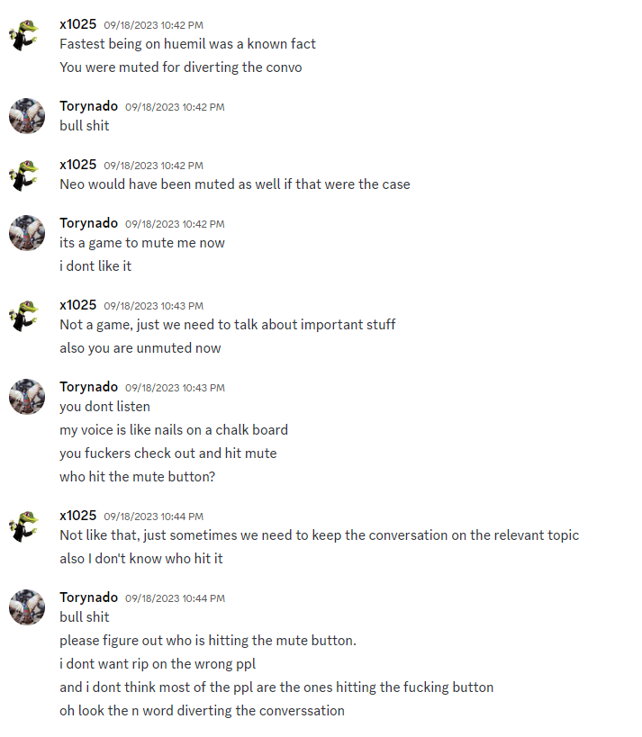
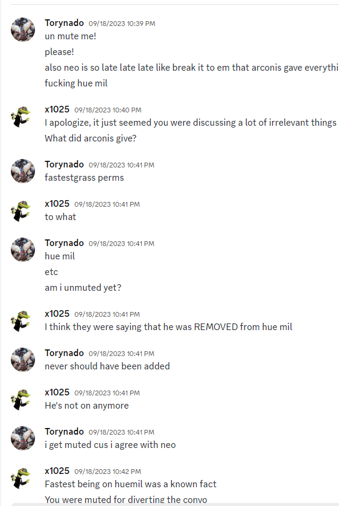

> 

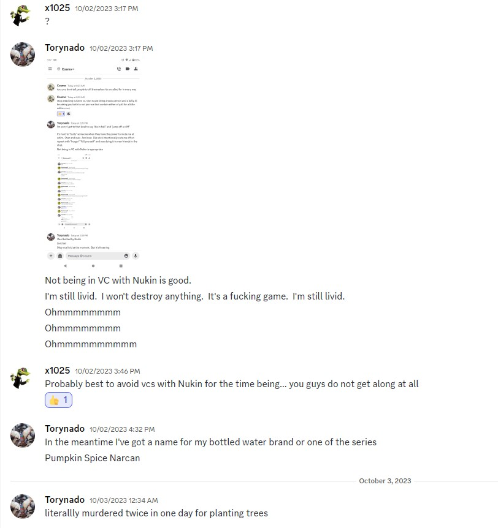

> 

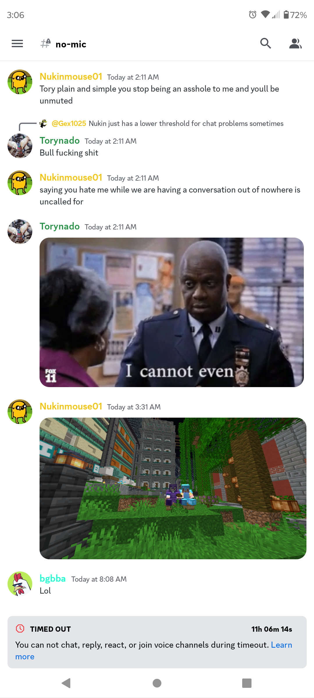
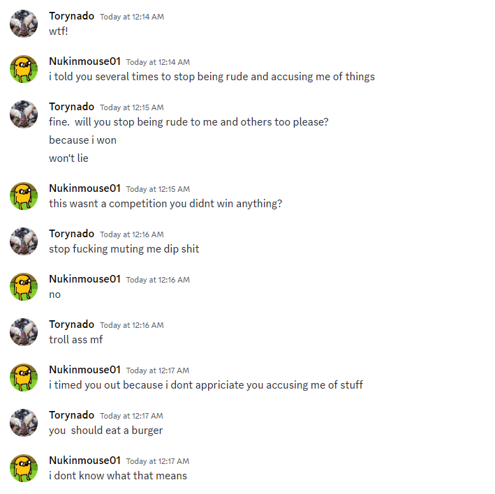

> 

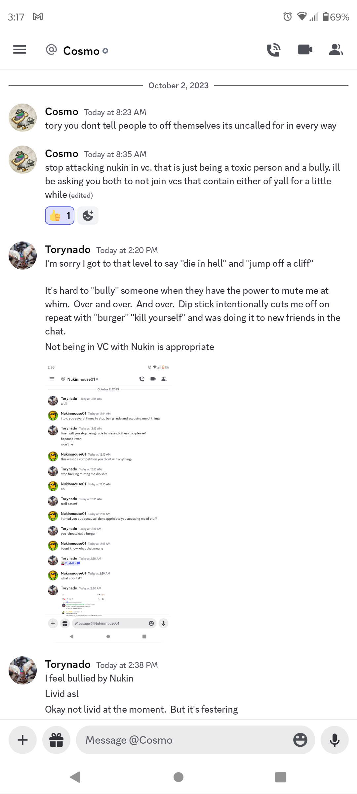

> Point 4 - Nukin Kills me in Kobylinski
> I stumbled across nukins bunker near koby on the ice road
> 
> I had hoped to follow the to Nara but they ran off faster than me so I started making my way back and I'm not great on the ice roads but recognized koby so I figured I'd go over there but I stumbled onto a non labeled Nukin bunker and got trapped behind an unreinforced steel door with no escape button on the other side.
> 
> There was a lodestone at *redacted*.  Nukin has since removed it .  So much for being one of the first koby builders or a citizen of yoahtl 
> 
> Iirc <@547001895458177044> was trapped similarly but not killed and not the same day
> 
> Point 5  - Nukin Kills me in altepetl.  
> 
> He could have take that tree down any day.  Instead he comes over to me, minding my own business in the woods, not talking to Nukin under advisement of multiple ppl and Nukin come over to fuck with me.
> 
> At the same time, I'm times out from the discord.  I can't type.  I can't hear.  I can't speak.  Leave me the fuck alone.  Could have waited an hr for me to log.  Ya'll have known that tree was there, I knew that tree was going down but you chose to come over there while muted and timed out to my physical in game location to remove it then
> 
> I said, "pick a different day". 
> 
> Nukin Kills me and I'm like fine I'll go play in the other woods
> 
> Only to be harassed and killed by x1025.
> Arken was advised and I was doing my own thing out of ppls way.
> 

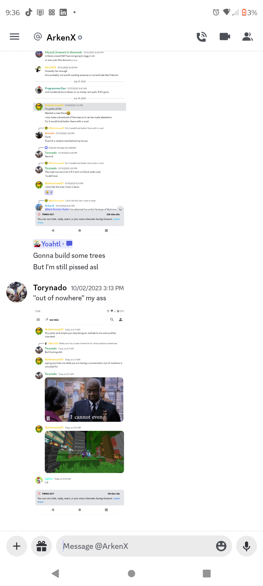

> Part - 6 gaslighting
> I believe I'm out of time but I've got more screenshots as needed
> Part 7 - insiding
> Ya'll don't trust me but you give fastest grass the keys to the city

**torynado**:

> Thank you for your patience your honor
> Im ready to proceed.

**awesome_daniel**:

> Thank you, counterclaimant, for presenting your evidence. We will now move on with the counter defendant's response, including any evidence and witness testimonies they may wish to present. `@nukinmouse` you may proceed.

**nukinmouse**:

> i will need some time to write out an arguement and gather the nessecary evidence etc
> `@awesome_daniel` Thank you for your patience,
> 
> In the above images is proof of the prior claim of people messaging her to get her to stop harassing me, none of these show any proof of me being the aggressor in fact it shows the opposite, that she in fact is the one causing issues and being the "problem".
> 
> As a counterpoint, the evidence of her being killed was an order from Arconis in council chambers that the judge is able to see was placed prior to me killing her. At the time i didnt have pearls when i killed her so X1025 then went to kill her. This order was given to put her on trial for this very issue that she has so kindly presented evidence against herself that she indeed did say these remarks and was warned against continuing to do so.
> 
> Given the immense lack of evidence to support her claim I ask that this counterclaim proceeding be dropped.
> 

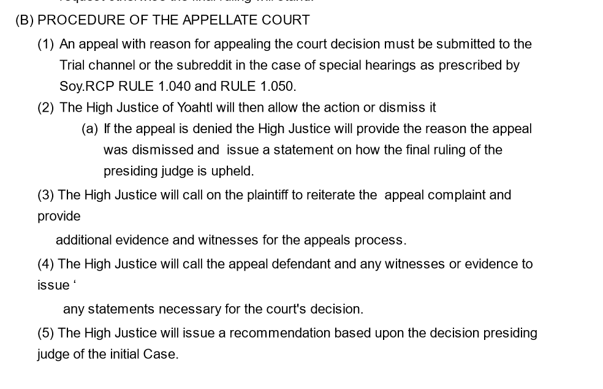

**awesome_daniel**:

> Thank you, counter defendant, for your response. In the interest of fairness and due process, a dismissal cannot occur unilaterally. Both parties must be in agreement for the proceedings to be dropped. Therefore, we will continue with the proceedings as scheduled unless both parties voluntarily decide to drop them. 
> 
> At this point in the proceedings, I would like to inquire if either party has any additional points, evidence, or statements they would like to present before we proceed to closing statements.

**nukinmouse**:

> No further statements

**torynado**:

> Thank you your honor,
> I appreciate this opportunity for mediation.  I want to stay friends.  I hope he acknowledges at least some of my points.
> 
> Sincerely, I don't want Nukinmouse or anyone else to die.  Tho if Nukin is standing on the edge of the trench one day, i might need to knock him into the water below.  I'll throw him some vines so he can get out.  i have 0 kills tho so like, even thats unlikely.

**awesome_daniel**:

> Thank you, we will now move on to closing statements. `@torynado` you may proceed.

**torynado**:

> Oh.  That was it.  
> 
> Thank you your honor,
> 
> I appreciate this opportunity for mediation.  I want to stay friends.  I hope he acknowledges at least some of my points.
> 
> Sincerely, I don't want Nukinmouse or anyone else to die.  Tho if Nukin is standing on the edge of the trench one day, i might need to knock him into the water below.  I'll throw him some vines so he can get out.  i have 0 kills tho so like, even thats unlikely.
> Thank you .
> And Praise the Pigeons

**awesome_daniel**:

> Thank you, counter claimant, for your closing statement. I will now turn to the counter defendant, `@nukinmouse`, to present any closing remarks.

**nukinmouse**:

> I don't really have anything to say about it I don't really care anymore just wanna chill

**awesome_daniel**:

> Before presenting the verdict, the court would like to clarify that the proceedings are based on the precedent set by the Appellate Decision of October 2019, which outlined definitions, hierarchies of harassment, and punishments.
> 
> Definitions:
> There are two defined types of harassment that are relevant to this case:
> - In-Game Harassment (IGH): Actions within the game that may cause emotional distress, directed with mal-intent, in retaliation, or that may exclude individuals based on personal matters. Examples include offensive language, repeated targeting, and defacing property.
> - On-Discord Harassment (ODH): Actions within Discord that cause emotional distress, are directed with mal-intent, in retaliation, or that may exclude individuals based on personal matters. Examples include inappropriate language, spam, harmful trolling, and threats.
> 
> Hierarchy of Acts:
> Harassment has been categorized into three levels of severity:
> 1. Incidental Harassment: The least severe act of harassment: any actions where the acting individual repeatedly creates acts that another player finds to be in a harassing manner, and the acting individual may not realize the acts to be in a harassing manner.
> 2. Minor Harassment: A moderate act of Harassment by an acting individual that causes distress to an individual, and the acting individual continues to repeat actions even after being repeatedly told to cease and desist harassing actions by the harassed individual or others.
> 3. Major Harassment: A severe act of Harassment by an acting individual done in a cruel and intentional manner done; with the intent of forcing someone to leave the community via means of repeated harassing acts, with the intent to cause someone great emotional distress, and/or with the intent of immense communal disruption.
> _ _
> The court has reviewed the charges brought against Torynado for Minor Harassment and has reached the following verdict:
> 
> Tornado has pleaded guilty to the Minor Harassment against Nukinmouse01. In accordance with the definition of Minor Harassment outlined under §3.2 of the Appellate Decision of October 2019, the court finds Tornado guilty of Minor Harassment as charged, both in-game (§2.A) and on Discord (§2.B).
> 
> The court hereby imposes the following punishment on Torynado for the offense of Minor Harassment:
> 
> 1. The court hereby issues Torynado a formal warning for their actions. This warning serves as a clear indication that their behavior, both in-game and on Discord, is unacceptable.
> 2. The court hereby requires Torynado to immediately cease any form of harassment, both in-game and on Discord, towards Nukinmouse01 or any other member of the community. 
> 3. The court hereby requires Torynado to issue a formal, written apology to Nukinmouse01 for their actions. This apology will be posted publicly on Yoahtl's Discord server.
> 4. As a consequence of their on-Discord harassment towards Nukinmouse01, the court hereby sentences Torynado to a temporary timeout on Discord lasting twenty-one (21) days. 
> 5. Considering the extension of harassment to in-game chat, the court hereby sentences Torynado to twenty-one (21) days of prison pearl time.
> 6. The court recognizes that Torynado did cease any harassment and will hereby grant Torynado the privilege of time served, effectively ending the sentence fifteen (15) days from now, on October 24, 2023.
> 
> The court emphasizes that engaging in such behavior, as demonstrated by Torynado’s actions, is considered bannable on CivMC, and extremely unacceptable within our community. Such conduct goes against the principles of respect, civility, and inclusivity that we uphold.
> _ _
> The court has reviewed the counterclaim filed by Torynado, formerly the defense, and has taken into consideration all the evidence and arguments presented therein. After examination of the evidence, arguments, and relevant precedents, the court renders its verdict on this counterclaim:
> 
> In reviewing the evidence presented in the counterclaim for Major Harassment, the court notes that the under §3.3 of the Appellate Decision of October 2019, Major Harassment is defined as "a severe act of Harassment by an acting individual done in a cruel and intentional manner.” However, the court finds that the counterclaim lacks substantial evidence to support the allegations of Major Harassment against Nukinmouse01. The evidence and arguments presented by the counter claimant, Torynado, do not establish that Nukinmouse01 engaged in such severe and intentional acts of harassment as defined.
> 
> Consequently, the court dismisses the counterclaim for Major Harassment filed by Torynado against Nukinmouse01, and Nukinmouse01 is acquitted of all Major Harassment charges.
> 
> Furthermore, to prevent conflict in the future, the court advises the counter defendant, Nukinmouse01, to cease any actions intended to exclude Torynado from voice chat or Discord interactions unless they engage in uncalled-for behavior, including harassment.
> 
> To conclude, the court encourages both parties to exercise restraint and seek amicable resolutions to conflicts in the future to prevent the recurrence of situations similar to this one. Such efforts will not only benefit the individuals involved but also contribute to the overall well-being of the community as a whole.
> 
> With this, the court is now dismissed. Thank you.

**nukinmouse**:

> as tory has apologized and been cordial to me can i request leniency 21 days time out and 21 days of prison pearl seems abit harsh

**awesome_daniel**:

> The court acknowledges Nukinmouse01's request for leniency in Torynado's punishment. Nukinmouse01 has requested that the timeout duration be eliminated and the prison pearl sentence be reduced by one week. After considering Nukinmouse01's statement, the court modifies the punishment as follows:
> 
> - Torynado shall no longer serve a timeout on Discord.
> - Torynado's prison pearl sentence will be reduced to fourteen (14) days, and they are granted the privilege of time served. This sentence will end in eight (8) days on October 17, 2023.
> 
> Furthermore, the court emphasizes that any future instances of harassment, either in-game or on Discord, will result in further consequences, including the potential for timeouts or more severe penalties.
> 
> The court now dismisses these proceedings, and this case is hereby closed.

**nukinmouse**:

> 

> right back at it

**MechanicalRift**:

> well im not gonna be surprised that she gets banned for that the admins/mods are generally on top of stuff like that said in global

**torynado**:

> What fucking evidence am I missing?
> 

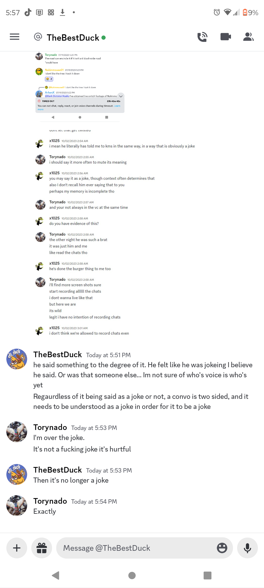

> 

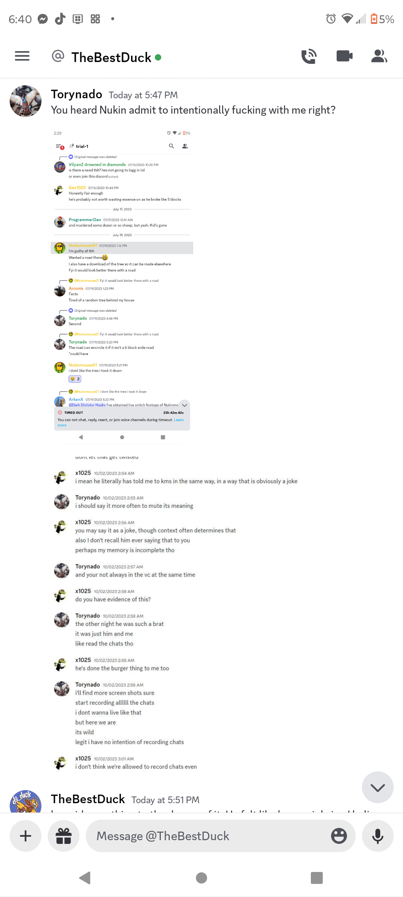

> Oh wait y'all are gaslighting shitters
> I gotta manage my expectations
> 3. Major Harassment
> A severe act of Harassment by an acting individual done in a cruel and
> intentional manner done; with the intent of forcing someone to leave the
> community via means of repeated harassing acts, with the intent to cause
> someone great emotional distress, and/or with the intent of immense
> communal disruption.
> `@awesome_daniel` are you questioning nukins intent?  That's so fucking there.  Repeated harassing acts?  How many do I need to list cus apparently I didn't list enough.  
> 
> Oh wait gaslighting shitters
> I hate y'all
> Rawr

**nukinmouse**:

> Like I said in vc I joined you one time and said burger a bunch of times I also apologized if it seemed harassing

**torynado**:

> Prove it dip stick

**nukinmouse**:

> <@135137849514131457> did i apolgize to tory about saying the burger thing

**MechanicalRift**:

> lads the trial is done. if you want to talk about trial things go to <#1144024926290968667>
> the rulings have been given drop it
> yall either make up somehow or never speak to eachother again

**awesome_daniel**:

> Due to Torynado's continued disruptive behavior despite the previous leniency granted in her punishment, the court has decided to reinstate the original sentence, revoking the privilege of time served. Torynado will serve the full duration of her initial punishment as previously determined by the court, which includes:
> 
> 1. A temporary timeout on Discord lasting twenty-one (21) days.
> 2. Twenty-one (21) days of prison pearl time.
> 
> Furthermore, the court reiterates the requirement for Torynado to issue a formal, written apology to Nukinmouse01 for their actions. This apology will be posted publicly. Additionally, Torynado is instructed to cease any harassment or disruptive behavior effective immediately, as failure to do so may result in more severe penalties.

**cr1zzpy**:

> I'm requesting a trial to appeal Torynado's sentence
> Me and `@galdeus` will be representing Torynado

**solitaire1**:

> you have to request an appeal from husky. The appeals process is a bit different to the trial process and I can't completely remember off the top of my head what the approval process is
> 

**cr1zzpy**:

> `@Huskydog9988` I'm requesting a trial to appeal Torynado's sentence

**solitaire1**:

> 

**cr1zzpy**:

> I don't think I have access in the Appelate court

**Huskydog9988**:

> this is that
> To clarify, your not appealing any other aspect of the ruling, you only wish to change her sentencing?

**cr1zzpy**:

> No, her crime doesn't fall under minor harassment because this was a one time thing and harassment in your rules is defined as repeated

**Huskydog9988**:

> So your appealing everything then

**cr1zzpy**:

> Yes

**Huskydog9988**:

> I'm gonna deny that then
> I'll only allow an arguement to reduce her sentancing

**cr1zzpy**:

> Our goal isn't to get her off with no sentence but the crime still doesn't fall under harassment
> Alright then, I still had other points planned in case this would happen can we request a trial to reduce sentence?

**Huskydog9988**:

> thats not how it works
> your don't get a trial
> you can only present me evidence

**cr1zzpy**:

> Seriously?

**solitaire1**:

> tory had her trial already and was found guilty

**cr1zzpy**:

> Can I have image perms?

**solitaire1**:

> there is now the appeals process where someone can "perpetuate the complaint on the belief of an unsatisfactory, unfair and unlawful ruling of a presiding judge"
> idk if I can give them to u but discord appears to be dieing which is why u may not be able to see them
> I'll try to dm them to you

**cr1zzpy**:

> What will you get from me just sending evidence

**Huskydog9988**:

> criz wants to send stuff

**solitaire1**:

> appeals process as stated above: 
> 1) An appeal with reason for appealing the court decision must be submitted in accordance with 1.050 (important bit is "on the belief of an unsatisfactory, unfair and unlawful final ruling")
> 2) High Justice allows action or dismisses it:
>         a) if dismissed high justice provides reason and issues statement on how final ruling of presiding judge is upheld
> 3) High justice calls on plaintiff to reiterate the appeal complaint and provide additional evidence and witnesses for the appeals process
> 4) High justice calls the appeal defendant and any witnesses or evidence to issue any statements necessary for courts decision 
> 5) high justice issues recommendation based upon decision of presiding judge of initial case
> There is no more arguing or cross examination as this is the appeals process now. That has all already occured in the original trial

**cr1zzpy**:

> Yes I read it but from my understanding I thought I would at least get to argue why this is unfair

**solitaire1**:

> that'd be both 1) appeal is submitted with reason for appealing and also 3) plaintiff to reiterate the appeal complaint wouldn't it ?
> Stating why you believe the result unfair would be the reason for the appeal

**Huskydog9988**:

> `@cr1zzpy` if you still plan on appealing her sentencing, I’m going to give you 24 hours to start making your case.

**cr1zzpy**:

> Yes sorry my discord was glitching out for a second there
> I understand that the court is completely justified to give `@torynado` punishment for her actions, letting something like this slide lets fellow Yoahtlians think they can do the same, but a 21 day sentence is overkill, Torynado has been a part of Yoahtl for 7 years, Im not saying she should get special treatment but this is just a good way to sour relations instead of discourage her actions. civ is like an addiction where a few days not playing is withdrawal for Tory but 21 days is rehab, a week would be more than enough disruption to discourage an active addicted civver like Torynado from repeating the same action and discourage the behavior to other Yoahtlians. I also have evidence of Nukin being witnessed by a high justice member saying death threats multiple times in a vc but it not being brought to court, and when nukin started trolling Torynado in the vc I dont think she was in on the joke or would she react like this he'd built up a lot of tension with his and her conflict when she retaliated he decided to use this to then chew her out in court, does Yoahtl really want to promote this kind of toxic behavior? Where you can just gaslight people into doing something stupid and then use it to send them to hell for 3 weeks? Nukin said he apologized for what he did in the vc but it has no meaning if he just takes her to court the next day, which I have a screenshot of him admitting to it while apologizing about it, for these reasons I propose the sentence be shortened to 10 days including time served, more than enough of a sentence.
> Evidence that a high justice member has witnessed nukin say kys in chat several times but not taken action please don't try to excuse him with y'all's stance on this case

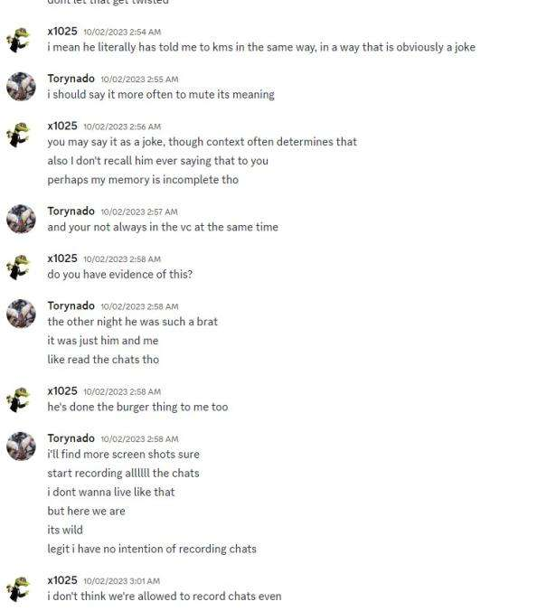

> His half hearted apology

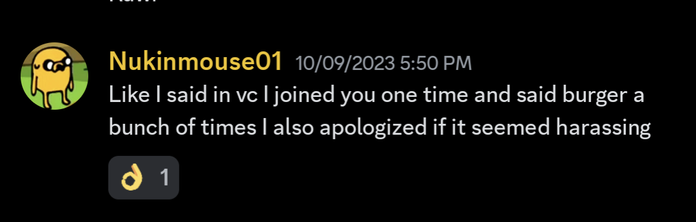

> Of what caused Torynado to react like this

**Huskydog9988**:

> so taking this at face value, she told him to kys over the burger thing?

**cr1zzpy**:

> They had previous tension and then he started muting her while she was talking to someone and using his soundboard basically
> If it doesn't matter also why would he apologize about it

**Huskydog9988**:

> I'm not here to debate whether nukin harrassed tory

**cr1zzpy**:

> Me neither
> My main point is that this is overkill
> It's like getting 21 days in jail for littering
> A week would be enough to make her remember this experience imo
> And not do it again
> With this 21 day sentence your souring relations with a 7 year dedicated member

**Huskydog9988**:

> If i killed someone after living in the UK for 7 years, id get the same treatment as someone else
> the same applies here

**cr1zzpy**:

> It's not murder though
> It's nowhere near the same

**Huskydog9988**:

> the point still stands

**cr1zzpy**:

> Yet you don't apply this to nukin
> He spits out death threats all the time but he's given special treatment

**Huskydog9988**:

> So initially, tory's punishment was reduced to 14 days on account of nukin petitioning the court the court to reduce it, and time served was allowed on account of Danial seeing tory trying to patch things up
> Things changed after the trial concluded where not even 12 hours later, she again told nukin to kys
> As per the trial ruling, if further instances of harassment are found, consequences will be levied

**cr1zzpy**:

> Hold up why are you ignoring me why is nukin not being punished the same way when he does this?

**Huskydog9988**:

> because thats not being appealed here

**Huskydog9988**:

> also i thought we weren't talking about nukin's guilt

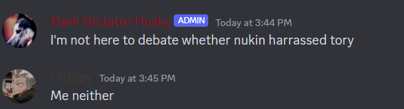

**cr1zzpy**:

> Ok but Id argue even the initial "lenient" punishment was still too high
> And in the screenshot nukin sent I don't see her telling anyone to kys she said "Gaslighting assholes can jump off a cliff and die in hell"
> Are you saying nukin is a gaslighting asshole

**Huskydog9988**:

> id say the implication of who she is talking about is clear

**cr1zzpy**:

> Prove it, she wasn't even talking to him she was in global what if she was just venting she didn't even direct it at him

**Huskydog9988**:

> im sorry, but the burden of proof doesn't lay upon me here

**cr1zzpy**:

> My point still stands
> She was just venting in global
> She didn't say anything to nukin at that time
> So if he felt targeted by it it's not her fault

**Huskydog9988**:

> Seeing as i was in a vc with her 30 secounds before she said that, I have so say your wrong
> she was explicitly talking about nukin, if not yoahtl as a whole

**cr1zzpy**:

> Husky let's say this was directed at you would you try to 
> A) Repair relationships with someone you upset
> B) Get someone who has been your comrade for 7 years in as much trouble as you possibly can and further the tension between each other with a 3 week pearl sentence
> What are you trying to promote in Yoahtl
> The sentence should be lowered
> It's way too much

**Huskydog9988**:

> seeing as how people have been reaching out to her throughout the course of this trail, talking to tory, i say your point is mute

**cr1zzpy**:

> Not from what I've seen

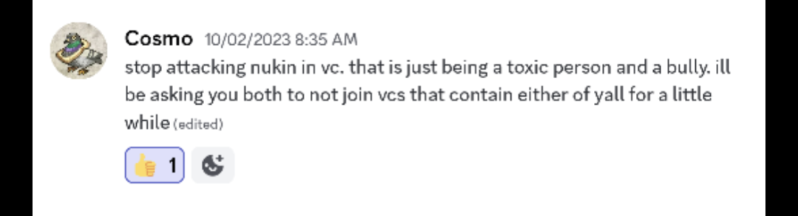

> Yeah "you're a toxic person and a bully"
> Great way to reach out

**Huskydog9988**:

> "that is just being a toxic person and a bully"

**cr1zzpy**:

> Is he referring to someone else?
> What???

**Huskydog9988**:

> you really are having trouble parsing subtext here

**cr1zzpy**:

> You haven't disproven me by saying this

**Huskydog9988**:

> at face value, this message is telling tory her current actions have been one of toxicity, and mech asked her to stop

**cr1zzpy**:

> While antagonizing her
> The underlying message is there

**Huskydog9988**:

> ?

**cr1zzpy**:

> Bro you can't read that and say the only thing hes saying is to stop
> By my definition "that is just being a toxic person and a bully" is him antagonizing her and ruins the message so no he's not just reaching out

**Huskydog9988**:

> 

> i don't see mech antagonizing tory here

**cr1zzpy**:

> The rest of the messages are just Tory
> In what way does this work against my point

**Huskydog9988**:

> if you have another point id like to hear it

**cr1zzpy**:

> Give me a second got to go through some screenshots
> Actually nevermind I don't need it for what I'm gonna say
> I want you to just think for a second, how long has Torynado been playing with you guys, for 7 years, are you confident you aren't using the same essence she made to imprison her rn, would you have the same security rn to be able to do it comfortably, would you not have lost some kind of war not for Tory's help, why are you using 21 days worth of essence to imprison your own citizen for such a minor crime, if this is the sentence for a 7 year member for drink driving what are the risks for a new Yoahtlian, is it even safe to join Yoahtl with these kind of strict laws?

**Huskydog9988**:

> what is your arguement here?
> how does this prove that tory doesn't deserve the punishment?

**cr1zzpy**:

> Im saying she's helped your nation way too much and when she slips up she gets put in the slammer for 3 weeks is this just?
> You wouldn't do the same for **certain people** when they act like this so she shouldn't have this kind of punishment either

**Huskydog9988**:

> im genuinely baffled by your argument

**galdeus**:

> I wouldnt go so far to say that she doesnt deserve punishment.
> What she said in retaliation was bad, I agree. And does she deserve punishment for that? Oc. But that doesnt leave nukim innocent of anything

**cr1zzpy**:

> He's also a lawyer
> In response to this what baffles you about my argument

**solitaire1**:

> If I may interject, nukin was the one bringing a case against Tory. If Tory wished to bring a case against nukin for the same offence she could do so

**cr1zzpy**:

> I'm not trying to prove his guilt right now but I'm saying that it's suspicious when the rule is applied to strictly to Tory when it is so loose otherwise

**solitaire1**:

> it's not "so loose" otherwise. The rule hasn't been applied to nukin because no one has sued nukin. It would only be "so loose otherwise" if there were multiple concurrent harassment cases and Tory's sentence was disproportional to the others who were found guilty

**cr1zzpy**:

> I have proof that it is

**Huskydog9988**:

> thats already been delt with
> the counter claim was rolled into the same trial

**cr1zzpy**:

> But Husky doesn't like that evidence because it's incriminating to nukin
> Yet it does prove my point that the rule is usually not enforced

**Huskydog9988**:

> no

**cr1zzpy**:

> A high justice member witnessed it
> But it's not enforced
> What more can I say

**galdeus**:

> And what was the veredict in that case?

**Huskydog9988**:

> ok first thats not a thing
> just stop

**solitaire1**:

> we don't "enforce rules" we have a legal system that people can choose to use to mediate their grievances between each other, people are also free to mediate and resolve their issues in private

**Huskydog9988**:

> omfg learn to read
> i don't want either of you two to talk till you figure out what your argument actually is
> if you do, thats it
> thats your argument
> im done running in circles
> and actually do your job
> read something for once

**cr1zzpy**:

> Your friend brought it up again
> I was addressing him

**Huskydog9988**:

> just stop talking

**cr1zzpy**:

> In future I will ignore him my apologies
> Can you please elaborate what is confusing about my argument?

**galdeus**:

> Sorry I just saw that the trial began. I may have lost some info on what was said on the meantime

**Huskydog9988**:

> im am going to time you both out for 30 minutes
> stop talking
> you too sol

**Arconis**:

> Sol stop
> ty ❤️

**solitaire1**:

> I think husky just said he was done discussing and that you need to actually decide what your position here is and basically post a formal appeal request as is required for him to then either allow or dismiss it

**Huskydog9988**:

> ok thats actually helpful
> thank you
> technically this is the appeal

**solitaire1**:

> You need to type up one coherent argument crizzpy and then post it and then that's it.
> 
> husky allows/dismisses it
> 
> then if it's allowed you can present evidence + witnesses but it's not necessarily an actual discussion between you and husky
> You basically present all your evidence + witnesses in one go, in one single block of text/images, you don't really ask husky if he agrees/disagrees with you or why

**cr1zzpy**:

> .
> .

**Huskydog9988**:

> is that your argument?
> its yes or no
> i don't need a paragraph

**cr1zzpy**:

> No

**Huskydog9988**:

> ok

**cr1zzpy**:

> I have more to say I'll try do it all in one go though
> I had a lot to say but I now realize that it doesn't matter, but I still have 2 reasons why Torynado's sentence must be shortened. First of all this is Torynado's first and only crime in Yoahtl, she's had a clean slate until now, given she did say something questionable in global and still definitely deserves to be sentenced. However if we look back at a precedent case (Aki v. Shygdsamkd, Jun 2021), we can see that the verdict of this case was 3 weeks punishment. In this case one of those weeks was for the harassment and the other 2 weeks were for raiding, in this trial Tory was presented with 3 weeks for her first offense of harassment, if we are counting the second offense in global that should be like 2 weeks, there shouldn't be a case where a second offense harassment gets a worse for punishment than raiding and harassment, I understand that judges can do their sentencing time differently but the value of what was stolen was 64 diamonds which isn't small for the common civver, but it was met with a 2 week punishment (excluding the week that was added for harassment) which is still less than the sentence present and the same as the sentence given initially, now in this case the level of harassment was not stated but we can deduce it is likely not major based off the sentencing time, so the punishment of a minor harassment should be less than or equal to the sentence given for raiding and for these reasons the sentence should be lowered down to 2 weeks including time served
> 
> Evidence: https://civyoahtl.github.io/judiciary/court-cases-precedents/aki_v_shygdsamkd_jun_2021.html

**Huskydog9988**:

> In Shy in Aki v. Shygdsamkd, 2021, while Shy was only pearled for 1 week due to the harassment charges, it’s the court’s opinion that the nature of the harassment perpetrated by Tory differs significantly from that of Shy. In Shy’s case, his harassment essentially culminated him sending taunting messages, and dumped junk into Aki’s mailbox. Tory’s case, however, differs in what I could consider a significant manner, she actively advocated for Nukin to commit self-harm. To make it explicitly clear, she deliberately, on multiple occasions, told Nukin to kill himself. In my eyes this is a significantly more serious offense than someone just being a nuisance as Shy was to Aki. As such, the time served for such an offense should be greater. Moving on, to address your point of the 64 diamonds of damage (in the Aki v. Shygdsamkd case) having less pearl time than Tory, I believe its justifiable. In my eyes, the crime of harassment is of greater significance than that of raiding. We shouldn’t value virtual items more than the potential psychological damage such abrasive messaging can cause to an actual human being. It is with this philosophy that I deny your appeal. `@cr1zzpy` `@torynado` `@galdeus`

**cr1zzpy**:

> what about the fact that this is a first offence

**cr1zzpy**:

> can you consider this too
> https://tenor.com/view/there%27s-nothing-we-can-do-gif-14390726165144583214
> ok i give up

**Huskydog9988**:

> She was already granted leniency, and it was based on, as you’ve repeated stated, her being with yoahtl for 7 years.
> Ik you stated before that civ is an addiction for her, so maybe this can act a form of mercy ban too

**cr1zzpy**:

> thank you for your time

