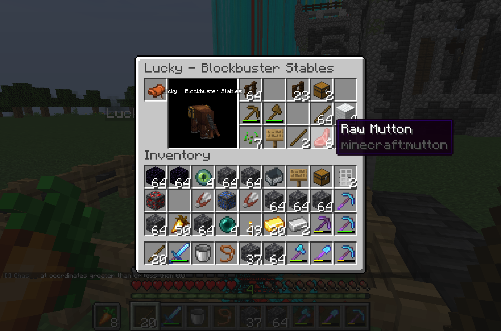
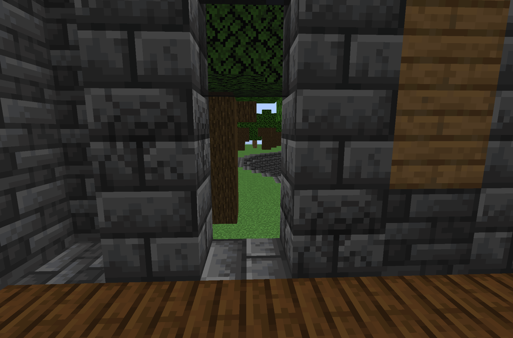
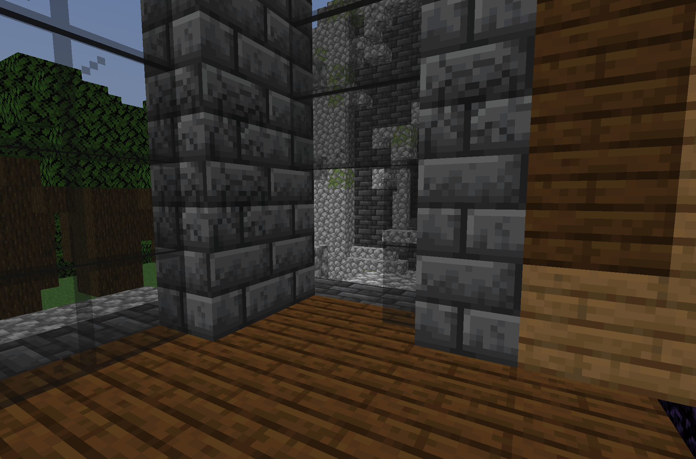
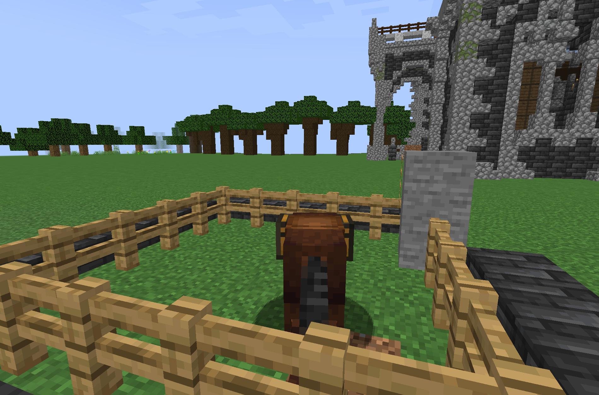
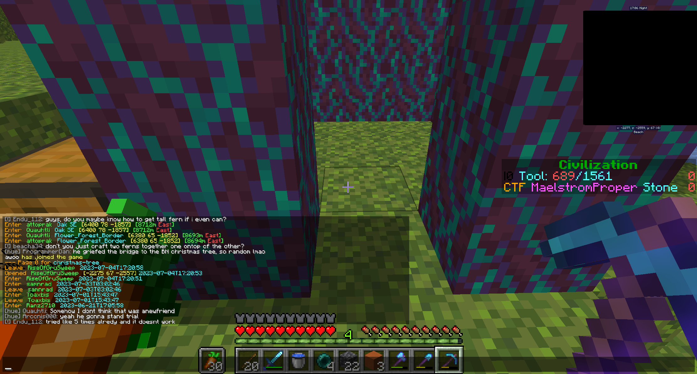

# Yoahtl v. RiseOfGruSweep, Jul 2023

## Case

With x1025 presiding, on the 13th of April 2023, Arconis charged RiseOfGruSweep with theft and tresspassing. RiseOfGruSweep was found guilty of Trespassing and Theft, and sentenced to 3 weeks prison pearl time. x1025 also ordered the defendant to return the stolen items if they hadnn't already.

## Proceedings

**Arconis**:

> Im suing riseofgrusweep for raiding yoahtl

> `@Huskydog9988`

**Huskydog9988**:

> Due to the ongoing elections I will postpone the trial until after the new council has been elected so that there isn't jank with someone loosing their councillorship while presiding over the case.

> The court will hear the case of Yoahtl VS riseofgrusweep for Theft and Tresspassing
> `@x1025` will preside
>
> All parties please familiarize or refresh yourselves on the court procedure.
>
> https://docs.google.com/document/d/1urUJ9o7k2CByBADDL66sHWqrjucepf6FzqIYRAxThgc/edit?usp=sharing Everyone involved please look over this to familiarize yourself with the procedure of the court.
>
> Also note any extraneous comments in this channel not related to the trial or anyone not called by the courts to present testimony will be deleted from this point until the end of trial. Please hold any other cases till the end as well. I SHOULDNT HAVE TO PUT THIS BUT ANYONE PARTICPATING IN THE TRIAL PLEASE WAIT TO SPEAK UNTIL CALLED UPON BY YOUR JUDGE AND LET THEM KNOW WHEN YOU HAVE FINISHED YOUR STATEMENTS.

**MechanicalRift**:

> does he have a discord...

**Huskydog9988**:

> it will probably through absentia

**x1025**:

> `@Councillor` I give the government 48 hours to find the discord associated with the defendant (RiseOfGruSweep) and bring them into the channel, after which a trial can be done. If the defendant is not found after this period of time, the trial will be conducted in absentia.

> 48 hours has passed. My assumption is the defendant has not been found to be contacted, is this right?

> `@Councillor`

**Arconis**:

> Yes

**x1025**:

> We will then be conducting the trial in absentia. Prosecution, may you present your opening statement.

> `@Councillor`

**Arconis**:

> RiseOfGruSweep was caught breaking and entering into a home in Homeland and was caught with contents of a chest that was broken inside.
>
> Granted the defendant hasnt logged in since the incident i would still like him to serve time in case they do join back

**x1025**:

> Since the defendent is not present, I call on prosecution to present any witnesses and evidence supporting the charges against the defendant RiseOfGruSweep

**ProgrammerDan**:

> These are screenshots from Maelstrom. None of this damage existed when I was on the property the day prior. Besides RiseOfGruSweep, very few people had been on the property, all of them Yoahtl'n citizens, to my knowledge.
>
> The fenced-in property where Lucky was moved to had, until that day, held perhaps a dozen sheep. Apparently those items were put into Lucky's inventory, after the sheep were slaughtered.
>
> Besides the front door being broken in, there were also a few other points of entry, which I have screenshotted above (including the pen for the sheep and the raw mutton from the dead sheep in Lucky's inventory).







> Here is when he first entered Maelstrom @ Homeland:
>
> ```
> [04Jul2023 12:59:59.799] [Render thread/INFO] [net.minecraft.client.gui.components.ChatComponent/]: [CHAT] Enter  RiseOfGruSweep  [Maelstrom-Yoahtl-Homeland]  [6598 xx -2121]  [13772m East]
> [04Jul2023 13:00:05.567] [Render thread/INFO] [net.minecraft.client.gui.components.ChatComponent/]: [CHAT] Enter  RiseOfGruSweep  [Maelstrom-Yoahtl-Homeland]  [6598 xx -2098]  [13774m East]
> ```
>
> This snitch in particular caught my interest, as it implied he either broke into the Factory building (the largest structure on the claim) or had entered a few bypasses underneath it:
>
> ```
> [04Jul2023 13:04:08.274] [Render thread/INFO] [net.minecraft.client.gui.components.ChatComponent/]: [CHAT] Enter  RiseOfGruSweep  [Maelstrom]_FactoryStorageBuildingEntran  [6460 xx -2069]  [13728m East]
> ```

> It was shortly after that, that I messaged him (logs slightly truncated for messaging purposes:
>
> ```
> [04Jul2023 13:05:36.707] [Render thread/INFO] [net.minecraft.client.gui.components.ChatComponent/]: [CHAT] To RiseOfGruSweep: how are you doing? enjoying Maelstrom @ Yoahtl?
> [04Jul2023 13:05:37.960] [Render thread/INFO] [net.minecraft.client.gui.components.ChatComponent/]: [CHAT] Enter  RiseOfGruSweep  [Maelstrom-Yoahtl-Homeland]  [6414 xx -2075]  [13727m East]
> [04Jul2023 13:05:39.867] [Render thread/INFO] [net.minecraft.client.gui.components.ChatComponent/]: [CHAT] Enter  RiseOfGruSweep  [Maelstrom-Yoahtl-Homeland]  [6437 xx -2052]  [13755m East]
> ...
> [04Jul2023 13:05:50.345] [Render thread/INFO] [net.minecraft.client.gui.components.ChatComponent/]: [CHAT] From RiseOfGruSweep: what are you talking about?
> ...
> [04Jul2023 13:06:10.515] [Render thread/INFO] [net.minecraft.client.gui.components.ChatComponent/]: [CHAT] To RiseOfGruSweep: The place you are standing on, is a homestead on Yoahtl, called Maelstrom in "Homeland"
> ...
> [04Jul2023 13:06:20.596] [Render thread/INFO] [net.minecraft.client.gui.components.ChatComponent/]: [CHAT] From RiseOfGruSweep: oh
> [04Jul2023 13:06:22.318] [Render thread/INFO] [net.minecraft.client.gui.components.ChatComponent/]: [CHAT] From RiseOfGruSweep: I am
> [04Jul2023 13:06:32.190] [Render thread/INFO] [net.minecraft.client.gui.components.ChatComponent/]: [CHAT] To RiseOfGruSweep: so just asking if you are having a good visit
> ...
> [04Jul2023 13:06:41.224] [Render thread/INFO] [net.minecraft.client.gui.components.ChatComponent/]: [CHAT] From RiseOfGruSweep: looting stuff
> ```

> (continued)
>
> ```
> [04Jul2023 13:06:56.180] [Render thread/INFO] [net.minecraft.client.gui.components.ChatComponent/]: [CHAT] To RiseOfGruSweep: that would be unwise
> [04Jul2023 13:06:57.962] [Render thread/INFO] [net.minecraft.client.gui.components.ChatComponent/]: [CHAT] Moeliii has left the game
> [04Jul2023 13:07:02.812] [Render thread/INFO] [net.minecraft.client.gui.components.ChatComponent/]: [CHAT] From RiseOfGruSweep: why?
> [04Jul2023 13:07:11.950] [Render thread/INFO] [net.minecraft.client.gui.components.ChatComponent/]: [CHAT] To RiseOfGruSweep: b/c that's my home, and I have many resources and friends
> [04Jul2023 13:07:22.374] [Render thread/INFO] [net.minecraft.client.gui.components.ChatComponent/]: [CHAT] From RiseOfGruSweep: aight
> [04Jul2023 13:07:30.013] [Render thread/INFO] [net.minecraft.client.gui.components.ChatComponent/]: [CHAT] To RiseOfGruSweep: who can hunt thiefs down and lock them away for a long time
> [04Jul2023 13:07:39.834] [Render thread/INFO] [net.minecraft.client.gui.components.ChatComponent/]: [CHAT] 455M4N has joined the game
> [04Jul2023 13:07:44.139] [Render thread/INFO] [net.minecraft.client.gui.components.ChatComponent/]: [CHAT] To RiseOfGruSweep: you are new to the server?
> [04Jul2023 13:07:45.822] [Render thread/INFO] [net.minecraft.client.gui.components.ChatComponent/]: [CHAT] TheTwixWrapper has joined the game
> [04Jul2023 13:07:45.962] [Render thread/INFO] [net.minecraft.client.gui.components.ChatComponent/]: [CHAT] TheTwixWrapper is brand new!
> [04Jul2023 13:07:48.991] [Render thread/INFO] [net.minecraft.client.gui.components.ChatComponent/]: [CHAT] From RiseOfGruSweep: yeah
> [04Jul2023 13:07:58.617] [Render thread/INFO] [net.minecraft.client.gui.components.ChatComponent/]: [CHAT] To RiseOfGruSweep: ahh, ok. So, I know what you are doing b/c of jukes / snitches
> [04Jul2023 13:08:06.571] [Render thread/INFO] [net.minecraft.client.gui.components.ChatComponent/]: [CHAT] To RiseOfGruSweep: they tell me where you are from any distance away
> ```

> Note that in the prior message, RiseOfGruSweep directly admits that he was looting stuff, and given snitch logs, _Maelstrom_ specifically.

> It was shortly after this that I messaged in hue about RiseOfGruSweep, and thankfully The Awesome Crew jumped into action. So, while RiseOfGruSweep suicided to respawn (into Kansas, ironically, closer to me where they broke into a home and unreinforce griefed a bridge into Butternut) they ultimately OTT directly to Qua, who apprehended them (Thank you!)

> If other evidence would be helpful, I can attempt to provide!

**Huskydog9988**:

> `@ProgrammerDan` did someone representing the government request you act as a witness?

**ProgrammerDan**:

> I apologize if I spoke out of turn. No-one asked me, but I'm in possession of evidence. If I spoke out of turn, delete my posts and proceed as you need to. I am the injured party, no-one in the government was, but I'm quite new to your way of handling things.

**Huskydog9988**:

> Yea so technically it’s the government suing gru (kinda like a prosecutor charging some with a crime), so it’s not permitted normally, but honestly it’s `@x1025` call

> As the presiding judge they have to power to accept this or not as there isn’t really precedent for wether you should accept an unrequested testimony or not.

> x1025, you need to decide if you wanna just allow it, throw it out, accept it with conditions, etc.

**x1025**:

> I think ProgrammerDan's evidence can be accepted as circumstantial evidence because it shows that the defendant was looting people, hence it strengthens the case against them. I would still like evidence to be presented of the defendant's actions in Yoahtl for me to convict them.

**Arconis**:

> That's my bad `@Huskydog9988` I forgot to tell you `@ProgrammerDan` would be supplying evidence against the defendant on our behalf as well as BN

**ProgrammerDan**:

> (To be clear, RiseOfGruSweep was in Yoahtl when he directly stated he was looting. Specifically, he was in Homeland, Yoahtl'n territory. So, this is direct _admission_ that he was looting while present in Yoahtl.
>
> I did not present any evidence of his actions in Butternut, although I can provide screenshots of the grief on a bridge, if helpful, although I spoke with TB and Butternut does not plan to directly pursue any claims)

**x1025**:

> Ope, I misread your original statement. Considering that he admitted to looting while in Yoahtl territory, I believe this is good evidence to admit. I would like the screenshots you mentioned though as I think they are relevent to the case as circumstantial evidence

**Huskydog9988**:

> all good, in the future you just need to tell the presiding judge in trial chat your calling a witness

**x1025**:

> I've edited my previous statement as the original came off as not impartial

**ProgrammerDan**:

> I apologize for having to black out the top corner, but the remainder is unmodified. I left the coordinates I was standing at for verification purposes. On my and TB (he came and checked with me)'s knowledge, those blocks were not there prior to RiseOfGruSweep's visit, and were there after, but I cannot swear to it. They were unreinforced (my comment in chat). One juke log caught him opening a chest at BN's communal Christmas tree, affixing his visit time in the timeline previously from my logs. There are other evidences that involve his specific direction of travel putting him on the bridge I screenshot above during this time that I cannot share, so at best I can present these circumstantial evidences.
>
> Thank you for allowing me to submit this evidence!




**x1025**:

> Thank you for the evidence. Is the prosecution's primary testimony and evidence complete?

> Checking before we move on

> It seems that the prosecution has presented all relevant evidence. Since we cannot hear from the defense or do cross-examination (due to the defendant's absence), I will be presenting a verdict:

> Theft: Guilty

> Tresspassing: Guilty

> For the defendent RiseOfGruSweep

> I sentence the defendant to 3 weeks of prison pearl time. It appears that all items were returned to their proper owners, but if not, the defendant must return these as well.
